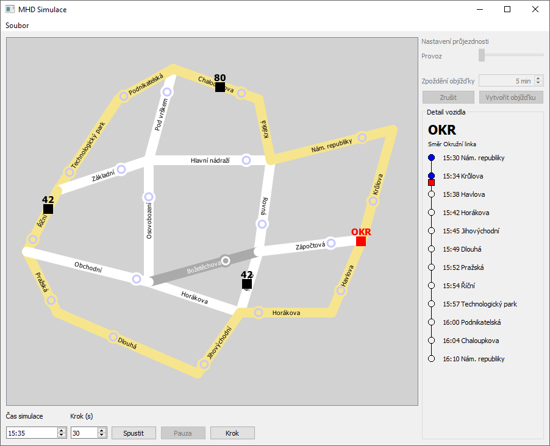

# ICP 2020 - MHD
Projekt do předmětu Seminář C++ (`ICP`). Aplikace psaná v Qt pro zobrazení linek hromadné dopravy a simulace jejich pohybu na dané mapě.

## Autoři
- Jan Chaloupka (`xchalo16`)
- Michal Krůl (`xkrulm00`)

## Spuštění
Ve složce `/examples` jsou ukázkové konfigurační soubory simulace. Po spuštění aplikace jsou automaticky načteny. Z kontextové nabídky lze načíst jiné (nebo stejné) soubory simulace.

Při načtení se vybírá celá složka, kde jsou soubory simulace uloženy. Soubory musí mít pevně dané názvy:

 - `streets.csv` obsahuje definice ulic
 - `lines.csv` obsahuje definie linek
 - `routes.csv` obsahuje trasy linek
 - `timetable.csv` obsahuje jízdní řád všech linek

Pokud některý soubor bude chybět, nečtení nebude dokončeno. Lze také provést rychlonačtení otevřené simulace opět přes kontextovou nabídku nebo stiskem klávesy `F5`. Tíme se zároveň resetuje simulace na výchozí hodnotu.

## Ovládání
Kolečkem myši lze mapu přibližovat nebo oddalovat. Kliknutím na spoj se zobrazí jeho itinerář na pravé straně aplikace. Kliknutím na ulici lze měnit provoz na této ulici. Provoz je indikován zbravením ulice (pokud není vybrána) - čím víc je ulice zbarvená do červena, tím je provoz hustější.

### Vytvoření objízdné trasy
Vybranou ulici lze uzavřít a nastavit objízdnou trasu linek. Takto vytvořená objízdná trase se projeví u nových spojů. Spoje na trase tuto objížďku ingorují.

Kroky vytvoření objízdné trasy:

 1. Na mapě vyberte ulici, kterou chcete uzavřít
 2. Klikněte v levém panelu na tlačítko "*Vytvořit objížďku*"
 3. Na mapě vyberte ulice (kliknutím), které budou součástí objízdné trasy.
    - Pořadí výběru je důležité! Spoje projedou ulicemi v pořadí jejich výběru.
    - Je nutné vybral minimálně dvě ulice tvořící objížďku.
    - Začátek a konec objízdné trasy musí navazovat na oba konce zavřené ulice.
 4. Pokud nejste s volbou spokojeni, můžete kliknout na tlačítko "*Zrušit*".
 5. Vyberte čas zpoždění, které linky objezdem naberou a svoji volbu potvrďte tlačítkem "*Potvrdit objížďku*".
 6. Ulice se znevýrazní a již dále nebude na mapě aktivní. Nové spoje se nyní budou této ulici vyhýbat objízdnou trasou (zastávka na uzavřené ulici bude ignorována).
